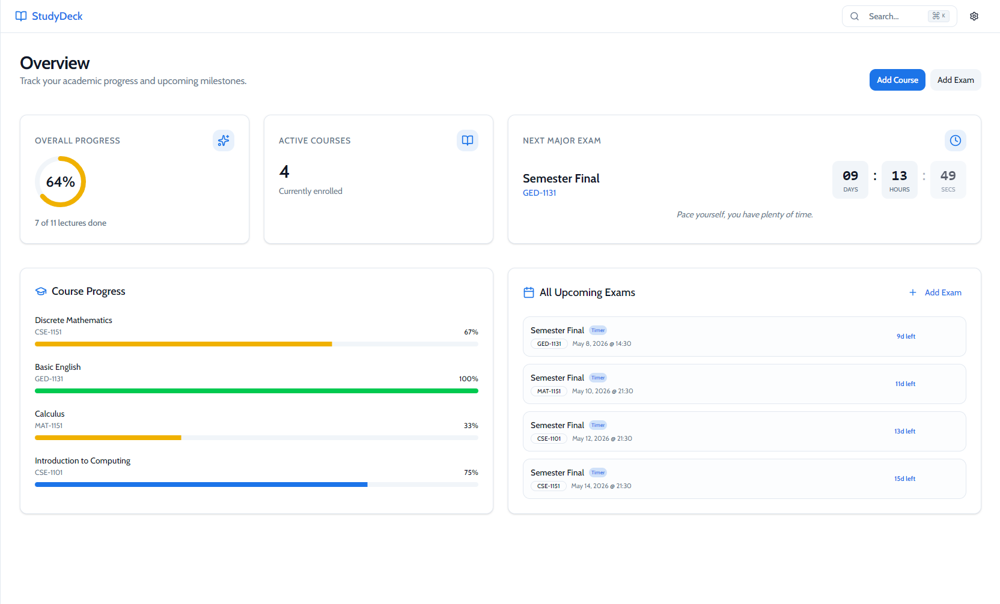
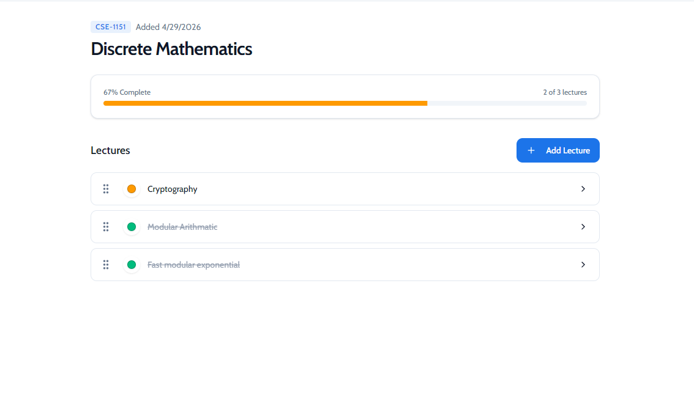
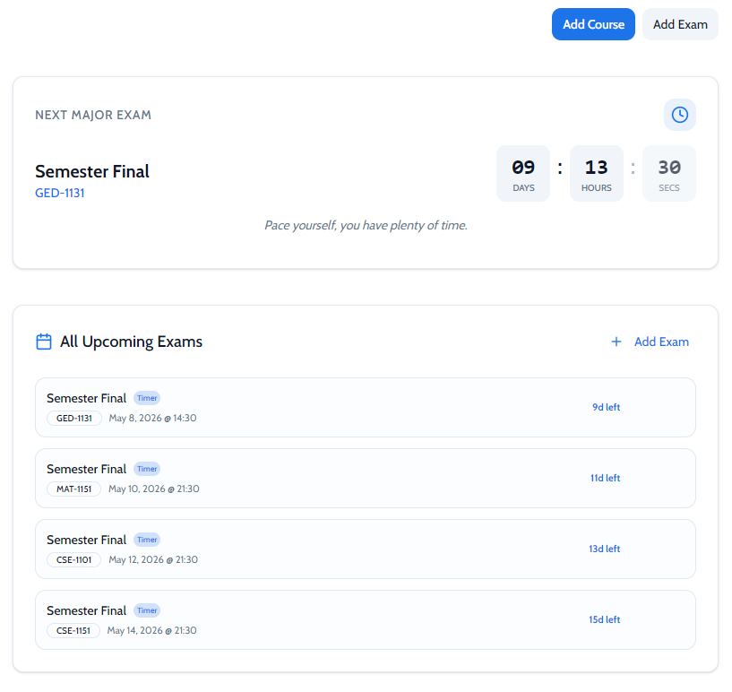
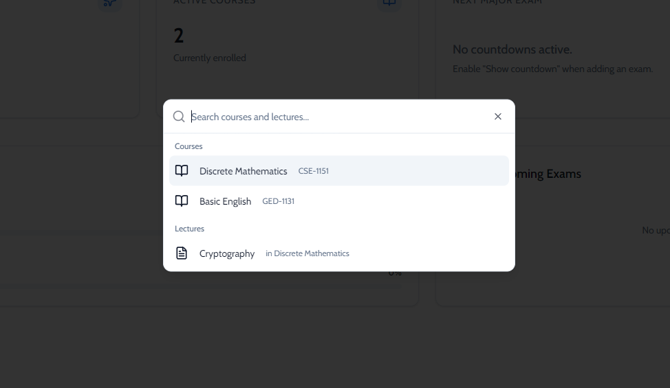
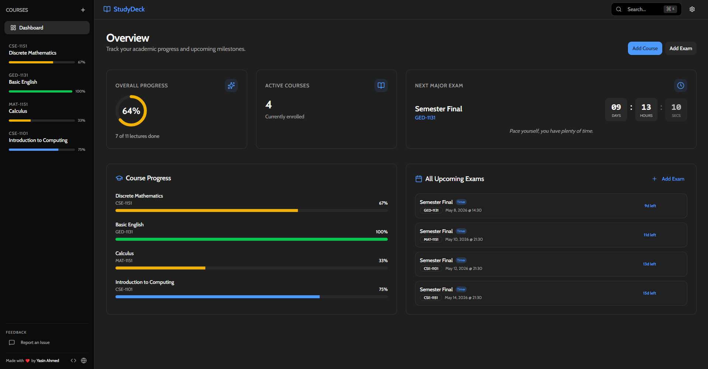

# 📚 StudyDeck

> A beautiful, offline-first desktop application to track your university study progress, manage courses, and never miss an exam.
---

## ✨ Features

| Feature | Description |
|---|---|
| 📊 **Dashboard** | Get a bird's-eye view of your overall progress, upcoming exams, and study stats |
| 📖 **Course Management** | Add, edit, reorder, and delete courses with drag-and-drop |
| 📝 **Lecture Tracking** | Track individual lecture status: Not Started, In Progress, Done, Needs Revision |
| 📅 **Exam Countdown** | Add upcoming exams with live countdown timers on your dashboard |
| 📎 **File Attachments** | Attach notes, PDFs, and slides to any lecture |
| 🔍 **Global Search** | Instantly search across all courses and lectures with `Ctrl+K` |
| 🌙 **Dark Mode** | Beautiful dark theme that's easy on the eyes during late-night study sessions |
| 💾 **Import/Export** | Backup your data or share individual courses with classmates |
| 🔄 **Auto Updates** | Automatically receives the latest version in the background |
| 🔒 **Privacy First** | All data stored locally on your machine. Optional anonymous telemetry. |

---

## 📸 Screenshots

### Dashboard


### Course View


### Exam Countdown


### Global Search


### Dark Mode


---

## 🚀 Download

📖 **First time here?** Check out the [User Guide](docs/USER_GUIDE.md) for a complete walkthrough of all features, shortcuts, and tips!

### Windows
Download the latest **StudyDeck Setup.exe** from the [Releases page](https://github.com/yazmiox/studydeck/releases).

Just run the installer — no configuration needed. The app will auto-update in the background when new versions are available.

> ⚠️ **Note for Windows Users:** Because this is an indie app from a student developer, it isn't "digitally signed" with an expensive certificate. When you first run the installer, Windows Defender SmartScreen will show a blue warning saying "Windows protected your PC." 
> 
> Simply click **More info** -> then click **Run anyway**. It's completely safe!

### Linux
Download the `.deb` (Debian/Ubuntu) or `.rpm` (Fedora/RHEL) package from [Releases](https://github.com/yazmiox/studydeck/releases).

### macOS
Download the appropriate version for your Mac from [Releases](https://github.com/yazmiox/studydeck/releases) and drag the app into your Applications folder:

*   **Apple Silicon (`-arm64`):** For newer Macs (M1, M2, M3, etc.)
*   **Intel (`-x64`):** For older Intel-based Macs.

> ⚠️ **Note for Mac Users:** Because this app is independently developed, it isn't notarized by Apple's $99/year developer program. When you try to open it the first time, macOS will show a scary warning saying the app is damaged or from an unidentified developer.
> 
> **To open it:**
> 1. Open your **Applications** folder in Finder.
> 2. **Right-click** (or Control-click) the StudyDeck app.
> 3. Click **Open** from the menu.
> 4. In the warning box that pops up, click **Open** again. You will only have to do this once!
---

## ⌨️ Keyboard Shortcuts

| Shortcut (Windows/Linux) | Shortcut (Mac) | Action |
|---|---|---|
| `Ctrl + K` | `Cmd ⌘ + K` | Open Global Search |
| `Ctrl + N` | `Cmd ⌘ + N` | Add New Course |
| `Ctrl + L` | `Cmd ⌘ + L` | Add New Lecture |

---

## 🛠️ Development

### Prerequisites
- [Node.js](https://nodejs.org/) (v18+)
- [pnpm](https://pnpm.io/) (v8+)

### Setup
```bash
# Clone the repo
git clone https://github.com/yazmiox/studydeck.git
cd studydeck

# Install dependencies
pnpm install

# Start development server
pnpm start
```

### Build
```bash
# Build for your current platform
pnpm run make
```

The installer will be generated in the `out/make/` directory.

---

## 👤 Author

**Yasin Ahmed**

- 🌐 [yasinahmed.dev](https://yasinahmed.dev)
- 💻 [github.com/yazmiox](https://github.com/yazmiox)
- 📧 myselfyasinahmed@gmail.com

---

<p align="center">
  Made with ❤️ by <a href="https://yasinahmed.dev">Yasin Ahmed</a>
</p>
