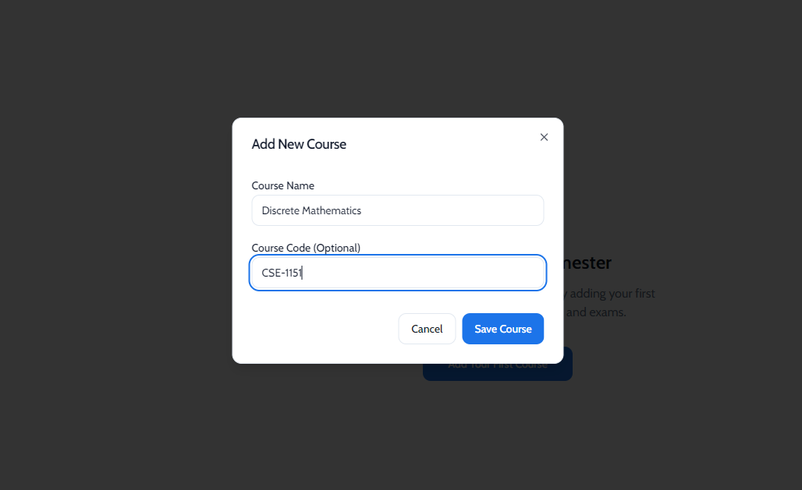
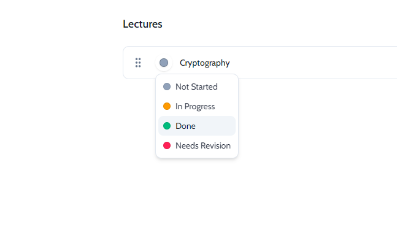
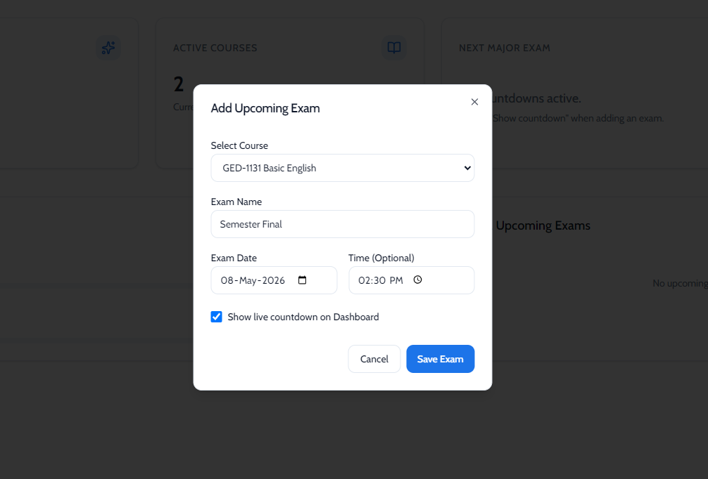

# 📚 StudyDeck User Guide

Welcome to StudyDeck! This guide will help you get the most out of the app.

---

## 🏠 Dashboard

When you open StudyDeck, you'll see the **Dashboard** — your command center for everything study-related.

The dashboard shows:
- **Overall Progress** — A circular progress ring showing how much of your total coursework is complete
- **Quick Stats** — Total lectures, completed lectures, and upcoming exams at a glance
- **Upcoming Exams** — A list of your next exams with countdown timers
- **Quick Actions** — Buttons to add a new course or schedule an exam

---

## 📖 Managing Courses

### Adding a Course
1. Click the **+** button in the sidebar (or press `Ctrl + N`)
2. Enter the **Course Name** (e.g., "Data Structures")
3. Enter the **Course Code** (e.g., "CSE 203")
4. Click **Save**

### Editing a Course
1. Hover over a course in the sidebar
2. Click the **⋮** (three dots) menu
3. Select **Edit**

### Deleting a Course
1. Hover over a course in the sidebar
2. Click the **⋮** menu → **Delete**
3. Confirm the deletion

### Reordering Courses
Simply **drag and drop** courses in the sidebar to reorder them.

---

## 📝 Managing Lectures

### Adding a Lecture
1. Select a course from the sidebar
2. Click **"Add Lecture"** (or press `Ctrl + L`)
3. Enter the lecture name
4. Click **Save**

### Updating Lecture Status
Each lecture has a status badge. Click it to cycle through:
- 🔘 **Not Started** — Haven't touched it yet
- 🟡 **In Progress** — Currently studying
- 🟢 **Done** — Fully completed
- 🔴 **Needs Revision** — Need to review again

### Adding Notes to a Lecture
1. Click on a lecture to expand it
2. Type your notes in the text area
3. Notes are saved automatically

### Attaching Files
1. Expand a lecture
2. Click the **📎 Attach** button
3. Select a file (PDFs, images, documents, etc.)
4. Click the attachment name anytime to open it

---

## 📅 Exam Management

### Scheduling an Exam
1. From the Dashboard, click **"Add Exam"**
2. Select the **Course** the exam belongs to
3. Enter the **Exam Name** (e.g., "Midterm", "CT-1")
4. Pick the **Date** and optionally the **Time**
5. Toggle **"Show live countdown"** if you want a timer on your dashboard
6. Click **Save**

### Exam Countdown
Exams with the countdown enabled will show a live timer on your dashboard counting down to the exact exam time.

---

## 🔍 Global Search

Press **`Ctrl + K`** to open the search dialog. You can instantly search across:
- Course names and codes
- Lecture names

Click any result to jump directly to that course or lecture.

---

## 💾 Import & Export

### Exporting Your Data
1. Open **Settings** (gear icon in the top-right)
2. Click **"Export All Data"**
3. Choose where to save the `.json` file

This creates a full backup of all your courses, lectures, exams, and settings.

### Exporting a Single Course
1. Hover over a course in the sidebar
2. Click **⋮** → **Export**
3. Share the `.json` file with a classmate!

### Importing Data
1. Open **Settings**
2. Click **"Import Data"**
3. Select a `.json` file
4. The app will detect if it's a full backup or a single course and handle it accordingly

---

## 🌙 Dark Mode

Toggle between light and dark mode:
1. Open **Settings** (gear icon)
2. Click the **"Dark"** or **"Light"** button

---

## 🔄 Updates

StudyDeck automatically checks for updates in the background. When a new version is available, it downloads silently and applies on the next restart.

To manually check:
1. Open **Settings**
2. Click **"Check for Updates"**

---

## ⌨️ Keyboard Shortcuts

| Shortcut | Action |
|---|---|
| `Ctrl + K` | Open Global Search |
| `Ctrl + N` | Add New Course |
| `Ctrl + L` | Add New Lecture (when a course is selected) |

---

## ❓ Need Help?

- **Found a bug?** [Report it on GitHub](https://github.com/yazmiox/studydeck/issues)
- **Have a suggestion?** Open a [feature request](https://github.com/yazmiox/studydeck/issues/new)
- **Contact the developer:** [yasinahmed.dev](https://yasinahmed.dev)
